summary: Swift Việt Nam - Setting up Xcode.
id: swiftvietnam_01-setting-up-xcode
categories: SwiftUI
tags: swiftvietnamapp
status: Published 
authors: An Tran
Feedback Link: https://swiftvietnam.com

# Swift Việt Nam - Bài 01: Setting up Xcode
<!-- ------------------------ -->
## Overview 
Duration: 1

### Bạn sẽ học gì?
- .
- Tải Xcode từ trang web của Apple.
- Cài đặt Xcode.
- Tạo một ứng dụng SwiftUI mới.

<!-- ------------------------ -->
## Đăng ký tài khoản lập trình viên Apple miễn phí
Duration: 2

### Mở [trang web Apple Developer](http://developer.apple.com/)
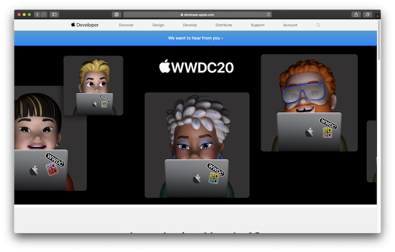

### Đăng ký tài khoản developer
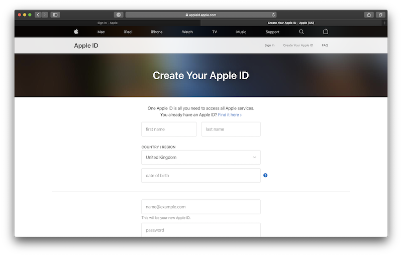

### Kiểm tra email
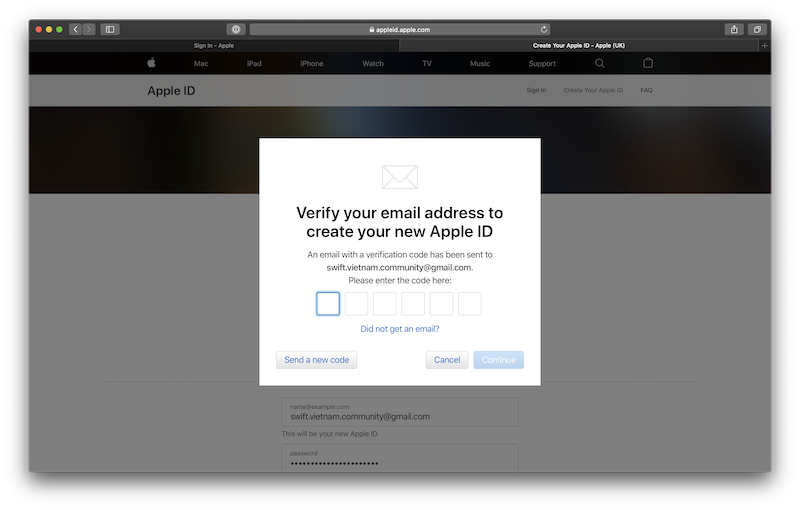

### Kiểm tra số điện thoại
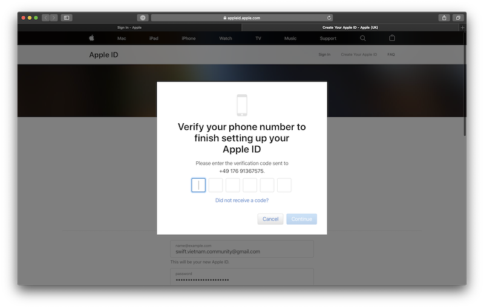

### Chấp nhận Apple Developer Agreement
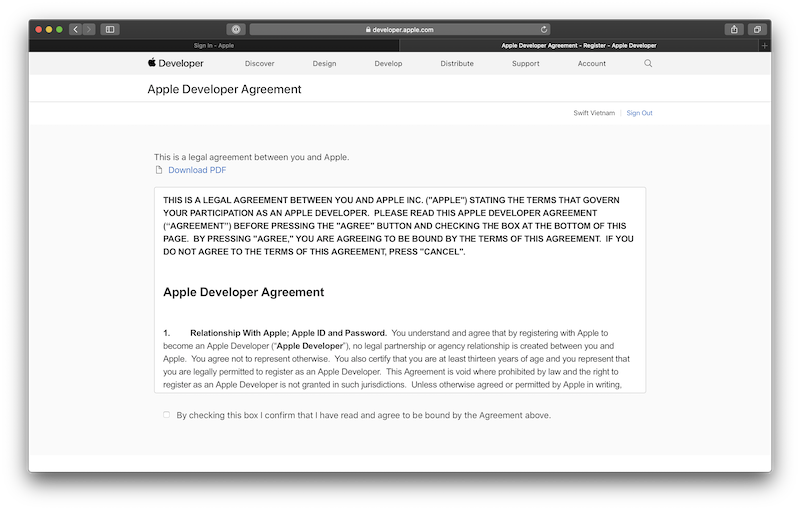

<!-- ------------------------ -->
## Tải Xcode 12 (beta)
Duration: 3

### Mở [Apple Developer Portal](http://developer.apple.com/)
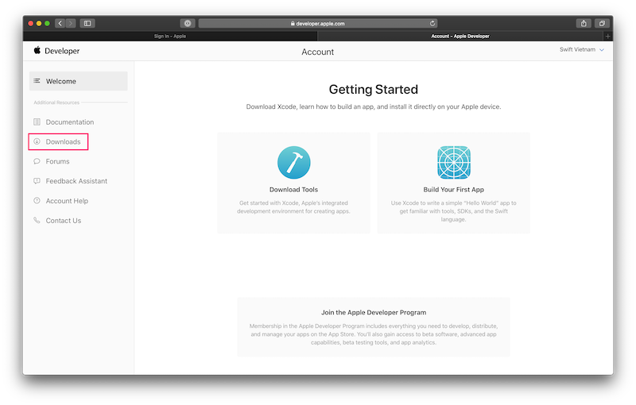

### Tải Xcode
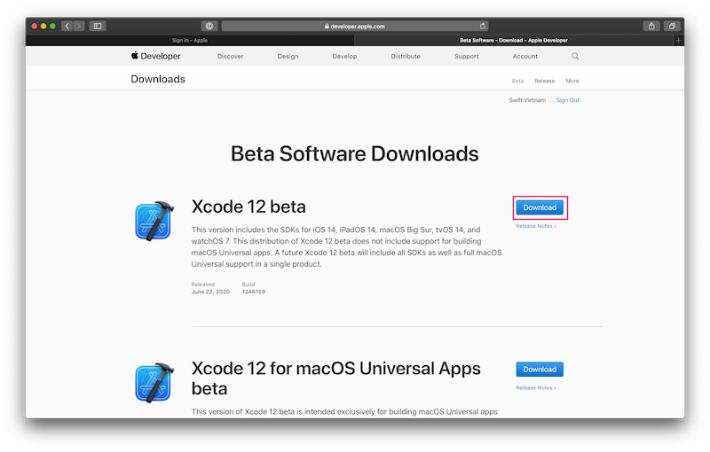

<!-- ------------------------ -->
## Đăng nhập vào Xcode
Duration: 3

### Cài đặt additonal tools cho Xcode
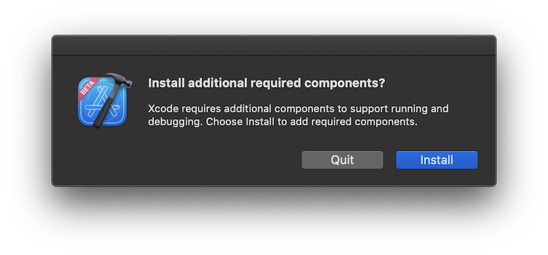
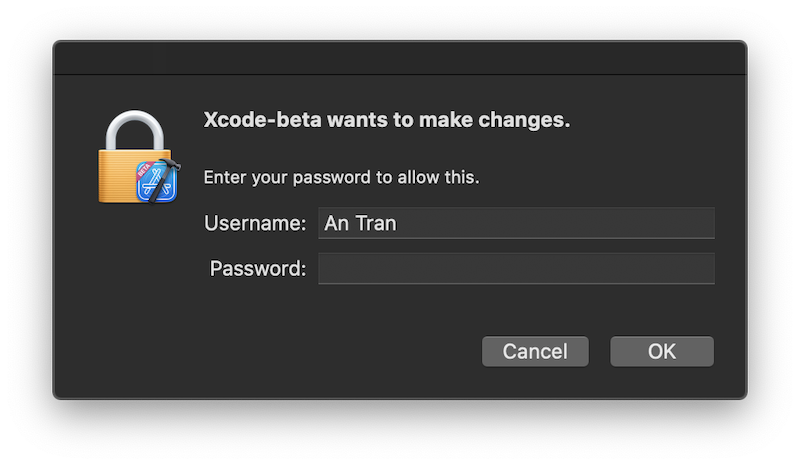

### Đăng nhập vào Xcode sử dụng tài khoản Apple developer.

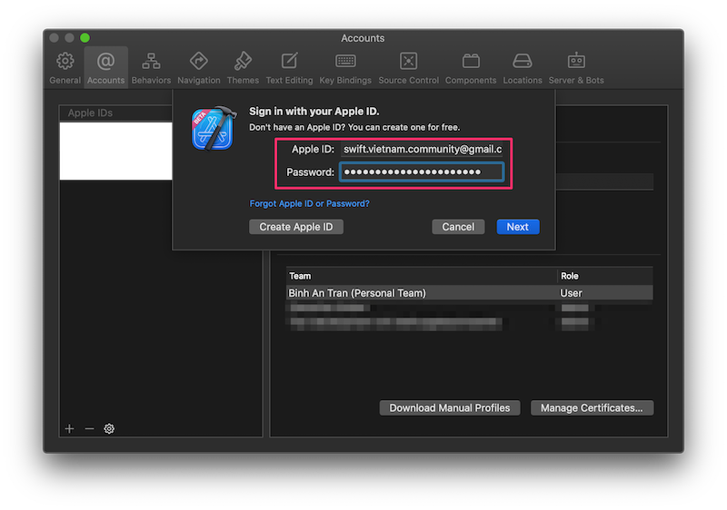
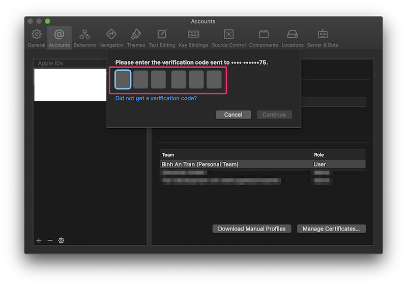

