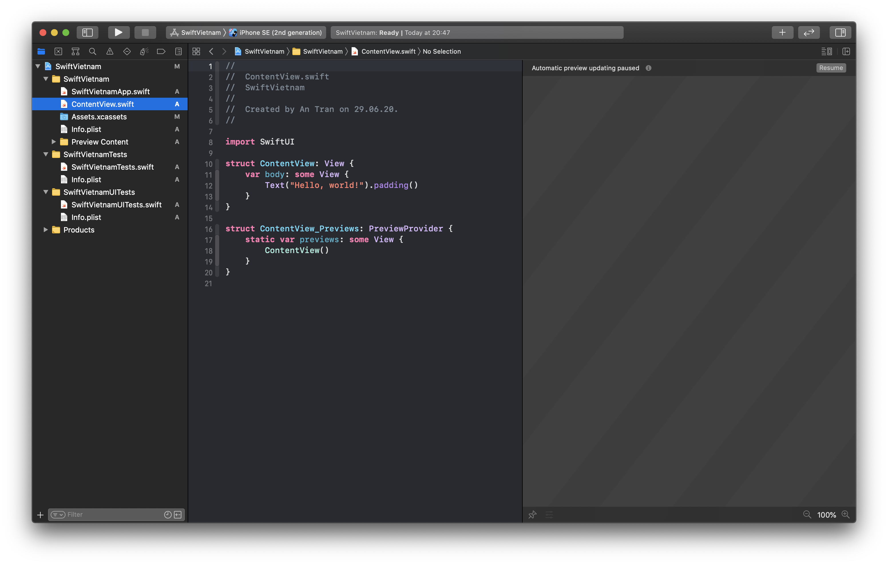
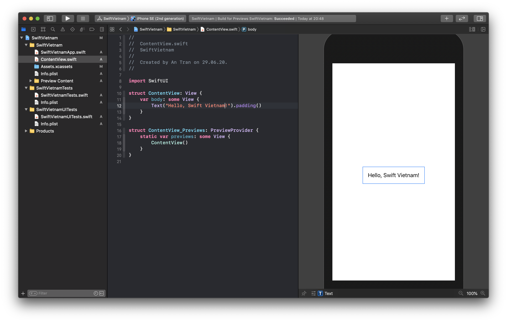

summary: Hello World SwiftUI.
id: 02-swiftui-hello-world
categories: swiftvietnam
tags: swiftvietnam
status: Published 
authors: An Tran
Feedback Link: https://swiftvietnam.com

# Hello World SwiftUI
<!-- ------------------------ -->
## Overview 
Duration: 1

### What You’ll Learn 
- Create a SwiftUI project from Xcode's template
- Create a `List`.
- Create a `CardView`.
- Make it dynamic.

<!-- ------------------------ -->
## Create a SwiftUI project
Duration: 3

### Create a SwiftUI project


### SwiftUI preview panel



<!-- ------------------------ -->
## Running on a simulator
Duration: 3

### Change "Hello, World" to "Hello, Swift Vietnam"

```swift
struct ContentView: View {
    var body: some View {
        Text("Hello, Swift Vietnam!").padding()
    }
}
```



### Run app on Simulator


<!-- ------------------------ -->
## Create a list
Duration: 3

```swift
struct ContentView: View {
    var body: some View {
        List {
            Text("Bản tin Swift 1")
        }
    }
}
```

<!-- ------------------------ -->
## Dupplicate the text
Duration: 3

```swift
struct ContentView: View {
    var body: some View {
        List {
            Text("Bản tin Swift #5")
            Text("Bản tin Swift #4")
            Text("Bản tin Swift #3")
            Text("Bản tin Swift #2")
            Text("Bản tin Swift #1")
        }
    }
}
```


<!-- ------------------------ -->
## Change headline font
Duration: 3

```swift
struct ContentView: View {
    var body: some View {
        List {
            Text("Bản tin Swift #5")
                .font(.headline)
            Text("Bản tin Swift #4")
                .font(.headline)
            Text("Bản tin Swift #3")
                .font(.headline)
            Text("Bản tin Swift #2")
                .font(.headline)
            Text("Bản tin Swift #1")
                .font(.headline)
        }
    }
}
```

<!-- ------------------------ -->
## Separate Item into `ItemView`
Duration: 3

- Separate the view of each item into a `ItemView`

```swift
struct ContentView: View {
    var body: some View {
        List {
            NewsItemView(title: "Bản tin Swift #5")
            NewsItemView(title: "Bản tin Swift #4")
            NewsItemView(title: "Bản tin Swift #3")
            NewsItemView(title: "Bản tin Swift #2")
            NewsItemView(title: "Bản tin Swift #1")
        }
    }
}

struct NewsItemView: View {
    var title: String

    var body: some View {
        Text(title)
            .font(.headline)
    }
}
```

<!-- 
## Cleanup the template project
Duration: 3

- Change the header: Keep it short and simple, make it generic and not containing changing parts (filename, timestamp).
- Wrap Preview in #DEBUG: Reduce app size, don't ship code not related to production.
-->