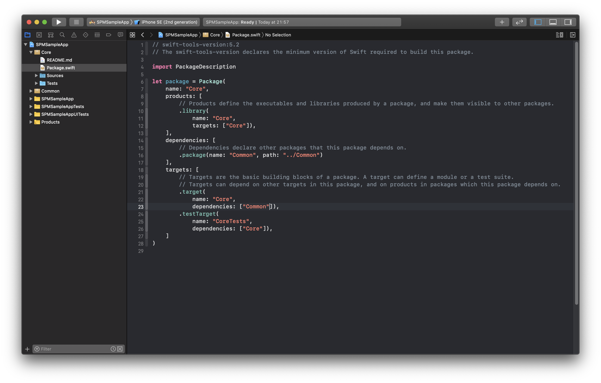

summary: Swift Package Manager Modularisation
id: swift_package_manager_modularisation
categories: Swift Package Manager
tags: swiftpackagemanager,modularisation
status: Published
authors: An Tran
Feedback Link: https://swiftvietnam.com

# Mô-đun hoá ứng dụng bằng Swift Package Manager
<!-- ------------------------ -->
## Giới thiệu chung 
Duration: 5

### Lời nói đầu

Swift Package Manager (SPM) đang dần có thể thay thế hoàn toàn Cocoapods hay Carthage để quản lý các thư viện phụ thuộc cho một ứng dụng iOS.

Bài viết này sẽ giới thiệu một ứng dụng mẫu sử dụng SPM để quản lý các thư viện tự phát triển. 

Việc phân chia mã nguồn ra các package khác nhau có nhiều lợi thế:
- Các packages có thể được phát triển, xây dựng và kiểm thử độc lập nhanh hơn.
- Giúp phân chia mã nguồn theo từng chức năng nhất định, hỗ trợ cho việc thiết kế một kiến trúc ứng dụng có tính mở rộng cao.
- Các packages có thể được chia sẻ giữa các dự án khác nhau.

### Bạn sẽ học gì?

- Khởi tạo một Swift Package.
- Quản lý liên kết phụ thuộc giữa các Swift Package.
- Tích hợp Swift Package vào một ứng dụng.
- Viết và chạy tests cho một Swift Package.
- Quản lý ứng dụng và Swift Package trong cùng một Workspace.

<!-- ------------------------ -->
## Khởi tạo một ứng dụng mới
Duration: 5

 
 
 

<!-- ------------------------ -->
## Common package  
Duration: 5

### Khởi tạo **Common** package
 
 
 

### Hiểu **Package.swift**

```swift
// swift-tools-version:5.2
import PackageDescription

let package = Package(
    name: "Common",
    products: [
        .library(
            name: "Common",
            targets: ["Common"]),
    ],
    dependencies: [
    ],
    targets: [
        .target(
            name: "Common",
            dependencies: []
        ),
        .testTarget(
            name: "CommonTests",
            dependencies: ["Common"]),
    ]
)
```

### Thêm **uppercased** property

```swift
// Common.swift

import Foundation

extension String {

    /// Uppercase the current string.
    public var uppercased: String {
        self.uppercased()
    }
}
```

<!-- ------------------------ -->
## Core package 
Duration: 5

### Khởi tạo **Core** package

 

### Thêm **Common** là dependency của **Core**

```swift
// Package.swift

// swift-tools-version:5.2
import PackageDescription

let package = Package(
    name: "Core",
    products: [
        .library(
            name: "Core",
            targets: ["Core"]),
    ],
    dependencies: [
        .package(name: "Common", path: "../Common")
    ],
    targets: [
        .target(
            name: "Core",
            dependencies: ["Common"]
        ),
        .testTarget(
            name: "CoreTests",
            dependencies: ["Core"]),
    ]
)
```

 

### Thêm **StringService**

```swift
// StringService.swift

import Foundation
import Common

public class StringService {

    static let prefix = "SPM"

    /**
     Uppercase the input string and add a prefix `SPM:` to it.

     - Parameter value: Input string

     - Returns: A new string prefixed with `SPM:` and uppercased
     */
    public func prefixAndUppercase(_ value: String?) -> String? {
        guard let value = value else { return nil }
        return "\(Self.prefix):\(value.uppercased)"
    }
}
```

 

### Thêm lớp Core

```swift
// Core.swift

import Foundation

public class Core {
    public let stringService: StringService

    public init() {
        self.stringService = StringService()
    }
}
```

 

<!-- ------------------------ -->
## Tích hợp Core vào ứng dụng
Duration: 5

 
 
 

<!-- ------------------------ -->
## Tạo và chạy tests
Duration: 5 

### Thêm tests cho **Common** package 
Duration: 5 

```swift
// CommonTests.swift

import XCTest
@testable import Common

final class CommonTests: XCTestCase {

    func testStringIsPrefixedAndUppercased() {
        let value = "text"
        let exptectedValue = "SPM: TEXT"

        let convertedValue = value.prefixedAndUppercased

        XCTAssertEqual(convertedValue, exptectedValue)
    }
}
```

### Thêm tests cho **Core** package

```swift
// CoreTests.swift

import XCTest
@testable import Core

final class CoreTests: XCTestCase {

    func testStringServiceCapitalisesText() {
        let value = "text"
        let exptectedValue = "SPM: TEXT"

        let stringService = StringService()
        let convertedValue = stringService.prefixAndUppercase(value)

        XCTAssertEqual(convertedValue, exptectedValue)
    }
}
```

### Configure to run tests 

 
 
 

<!-- ------------------------ -->
## Thêm giao diện cho app 
Duration: 10

### Chỉnh sửa UI 

 
 

### Thêm chức năng

```swift
// ViewController.swift

import UIKit
import Core

class ViewController: UIViewController {

    @IBOutlet weak var textField: UITextField!
    @IBOutlet weak var convertButton: UIButton!
    @IBOutlet weak var label: UILabel!

    var core: Core!

    override func viewDidLoad() {
        super.viewDidLoad()

        core = Core()
    }

    @IBAction func convert(_ sender: Any) {
        label.text = core.stringService.prefixAndUppercase(textField.text)
    }
}
```

<!-- ------------------------ -->
## Thêm UI Test cho ứng dụng 
Duration: 5

### Thêm UI Test 

```swift
// SPMSampleAppUITests.swift

import XCTest

class SPMSampleAppUITests: XCTestCase {

    var app: XCUIApplication!

    override func setUp() {
        app = XCUIApplication()
        app.launch()
    }

    func testConvertText() {
        let textField = app.textFields["text_input"]
        textField.tap()
        textField.typeText("text")

        app.buttons["Convert it!"].tap()

        XCTAssertTrue(app.staticTexts["SPM:TEXT"].exists)
    }
}
```

### Chạy test

 

<!-- ------------------------ -->
## Lời kết 
Duration: 5

### Lợi ích

- Việc phân chia nhỏ mã nguồn thành từng Swift Package giúp cho việc quản lý và bảo trì dự án tốt hơn.
- Tăng tốc xây dựng dự án vì các packages có thể dược xây dựng và kiểm thử độc lập với nhau.
- Việc phân chia packages buộc lập trình viên phải định nghĩa các API cho mỗi package một cách rõ ràng, từ đó một cách gián tiếp nâng cao chất lượng mã nguồn.
- Các packages có thể được chia sẻ một cách dễ dàng giữa nhiều ứng dụng khác nhau.

### Mã nguồn

- Tham khảo mã nguồn của dự án mẫu [tại đây](https://github.com/SwiftVietnam/Samples/tree/master/SPMSample) 