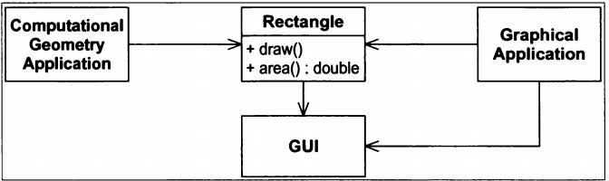
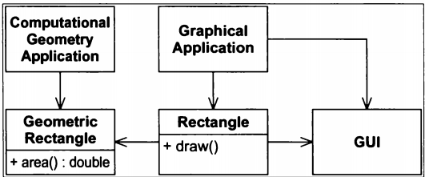

summary: S.O.L.I.D in Swift
id: swift_solid
categories: design pattern
tags: swiftpackagemanager,modularisation
status: Hidden
authors: An Tran
Feedback Link: https://swiftvietnam.com

# Single Reponsibility Princible - Đơn nhiệm (trách nhiệm duy nhất)
<!-- ------------------------ -->
## Định nghĩa SRP:
Duration: 5

> "There should never be more than one reason for a class to change." -SRP: The Single Responsibility Principle

Nguyên tắc trách nhiệm duy nhất (tiếng Anh: single responsibility) phát biểu rằng mỗi lớp chỉ nên có một trách nhiệm duy nhất, và rằng trách nhiệm đó nên được đóng gói hoàn toàn bởi lớp đó. Tất cả các dịch vụ của lớp đó cần được định hướng chặt chẽ theo trách nhiệm đó. [1]

### Tại sao cần SRP:

Để hình dung một cách đơn giản, nếu bạn là một người phát triển phần mềm, thì bạn nên tập trung vào việc viết code và các vấn đề liên quan đến phần mềm, các việc lặt vặt như lau dọn văn phòng, đóng mở cửa văn phòng .v.v.. thì hãy để cho người khác làm (ví dụ như công ty sẽ thuê người lao công để làm các việc này). Phân công công việc theo chuyên môn như thế vừa giúp bạn tập trung vào công việc để đạt được hiệu quả cao, vừa giúp văn phòng sạch sẽ hơn (vì người lao công sẽ lau dọn sạch hơn bạn ^^).


Hãy thử xem xét, với quỹ thời gian có hạn trong ngày, một mình bạn vừa phải làm công việc chính để có thu nhập nuôi gia đình, vừa phải lo chăm sóc con nhỏ, cho con bú … lại phải nấu nướng, giặt giũ, chăm vườn, tưới cây, … khi đó mặc dù có thể làm được nhiều việc một lúc, nhưng khả năng cao là bạn sẽ chẳng hoàn thành được tốt việc nào cả.


Chúng ta cùng nhìn vào con dao "đa năng" ở phía trên. Dao, kéo, mở nút chai... cái gì cũng có, hmm "có vẻ" tiện đấy. Thế nhưng mà to quá, muốn dùng mỗi con dao mà vác cả đống này theo thì hơi mệt. Đặc biệt là nếu 1 cái kìm ở trong này bị hỏng thì tháo nó ra để sửa khá là mệt đấy, chưa kể lúc lắp vào không biết có thừa hay thiếu con vít nào không (yaoming)

Trong lập trình cũng vậy, một class có quá nhiều chức năng cũng sẽ trở nên cồng kềnh và phức tạp. Với sự phát triển của ứng dụng, các requirement liên tục thay đổi dẫn tới sự thay đổi code. Nếu một class quá nhiều chức năng sẽ khó thay đổi, tốn nhiều thời gian sửa chữa hơn và có thể ảnh hưởng tới các module đang chạy khác.

<!-- ------------------------ -->
## SRP - Case study 1 
Duration: 10

```swift
class Rectangle {
    func draw() {}
    func area() {}
}
```

Giả sử có 2 ứng dụng cần sử dụng class Rectangle. Một ứng dụng tính toán, sử dụng function `area()` để tính diện tích, ứng dụng này không sử dụng đến function `draw()`. Một ứng dụng đồ họa khác sử dụng function `draw()` để vẽ hình, ứng dụng này lại không sử dụng function `area()`.



Thiết kế trên đã vi phạm SPR. Class Rectangle đã mang 2 trách nhiệm:

Trách nhiệm thứ nhất là cung cấp thuật toán để tính toán diện tích
Trách nhiệm thứ hai là biểu diễn Rectangle trong giao diện người dùng.
Khi một trong 2 ứng dụng yêu cầu thay đổi, chúng ta đều phải thay đổi class Rectangle

Để giải quyết vấn đề này chúng ta tách function area từ Rectangle ra một class mới GeomatricRectangle, class này sử dụng class Rectangle.

```swift
class GeomatricRectangle
{
    public function area();
}
```

Ứng dụng tính toán sẽ sử dụng GeomatricRectangle thay cho Rectangle.



Với cách thiết kế này, khi yêu cầu của ứng dụng tính diện tích thay đổi sẽ không còn tác động trực tiếp tới class Rectangle và ứng dụng đồ họa thay đổi cũng không ảnh hưởng tưởng tới class GeomatricRectangle.

<!-- ------------------------ -->
## SRP - Case study 2
Duration: 10

```swift
class AirConditionerOld {
    func turnOn() {}
    func turnOff() {}
    func changeMode() {}
    func changeFanSpeed() {}
}
````

This AirConditionerOld class violates the Single Responsibility Principle. The responsibilities are:
- A air conditioner can be Switch On or OFF features.
- A air conditioner can provide Change Mode features.
- A air conditioner provides Change Fan Speed features.

We’ve decoupled a air conditioner’s responsibilities into three separate interfaces. This prevents the ‘users’ of AirConditionerOld from mixing these responsibilities.

```swift
protocol SwitchOption {
    func turnOn()
    func turnOff()
}

protocol ModeOption {
    func changeMode()
}

protocol FanSpeedOption {
    func controlWindSpeed()
}
```

```swift
class Switch: SwitchOption {
    func turnOn() {
        print("Turn on")
    }

    func turnOff() {
        print("Turn off")
    }
}

class Mode: ModeOption {

}

class FanSpeed: FanSpeedOption {

}
```

```swift
class AirConditionerNew: SwitchOption, ModeOption, FanSpeedOption {
    let modeController = Mode()
    let fanspeedController = FanSpeed()
    let switchController = Switch()

    func turnOn() {
        switchController.turnOn()        
    }

    func turnOff() {
        switchController.turnOff()
    }

    func changeMode() {
        modeController.changeMode()
    }

    func controlWindSpeed() {
        fanspeedController.controllWindSpeed()
    }
}
```

<!-- ------------------------ -->
## SRP - Case study 3
Duration: 10

Networking Class
- fetch
- parse
- cache

```swift
class Handler {
    func handle() {
        let data = requestDataToAPI()
        let array = parse(data: data)
        saveToDB(array: array)
    }
    private func requestDataToAPI() -> Data {
        // send API request and wait the response
    }
    private func parse(data: Data) -> [String] {
        // parse the data and create the array
    }
    private func saveToDB(array: [String]) {
        // save the array in a database (CoreData/Realm/...)
    }
}
```
How many responsibilities does this class have?

Handler retrieves the data from the API (1), parses the API response, creating an array of String, (2) and saves the array in a database (3).

Once you consider that you have to use in the same class Alamofire for the API request, ObjectMapper for the parsing and the CoreData stack to save the data in the database, you will start understanding the smell of this class.

```swift
class Handler {
    let apiHandler: APIHandler
    let parseHandler: ParseHandler
    let dbHandler: DBHandler
    init(apiHandler: APIHandler, parseHandler: ParseHandler, dbHandler: DBHandler) {
        self.apiHandler = apiHandler
        self.parseHandler = parseHandler
        self.dbHandler = dbHandler
    }
    func handle() {
        let data = apiHandler.requestDataToAPI()
        let array = parseHandler.parse(data: data)
        dbHandler.saveToDB(array: array)
    }
}
class APIHandler {
    func requestDataToAPI() -> Data {
        // send API request and wait the response
    }
}
class ParseHandler {
    func parse(data: Data) -> [String] {
        // parse the data and create the array
    }
}
class DBHandler {
    func saveToDB(array: [String]) {
        // save the array in a database (CoreData/Realm/...)
    }
}
```

This principle helps you to keep your classes as clean as possible. Moreover, in the first example you couldn’t test requestDataToAPI, parse and saveToDB directly, since those were private methods. After the refactor, you can easily do it testing APIHandler, ParseHandler and DBHandler.
---

[1]: https://vi.wikipedia.org/wiki/Nguy%C3%AAn_t%E1%BA%AFc_tr%C3%A1ch_nhi%E1%BB%87m_duy_nh%E1%BA%A5t "Wikipedia"

https://medium.com/ios-expert-series-or-interview-series/solid-design-principle-using-swift-34bb1731cfb3

