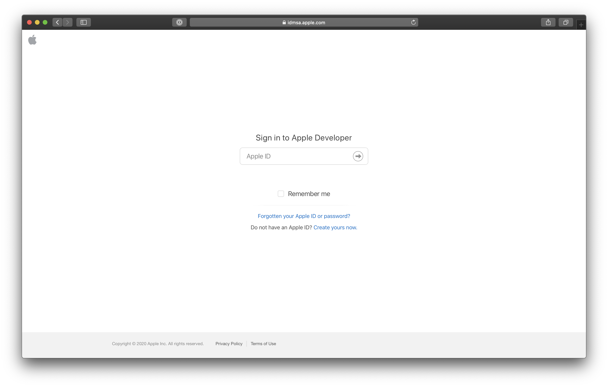
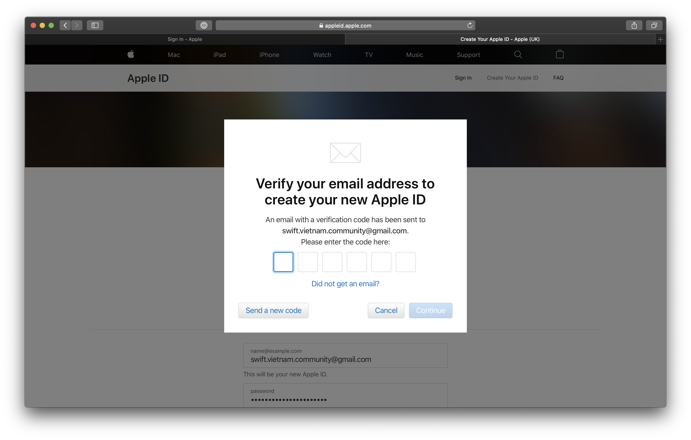
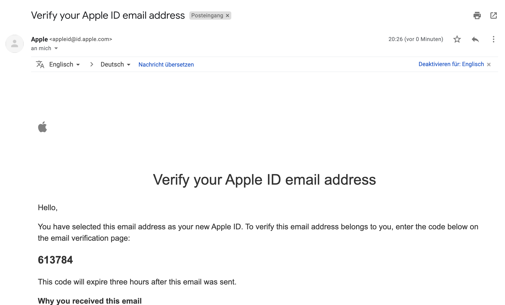
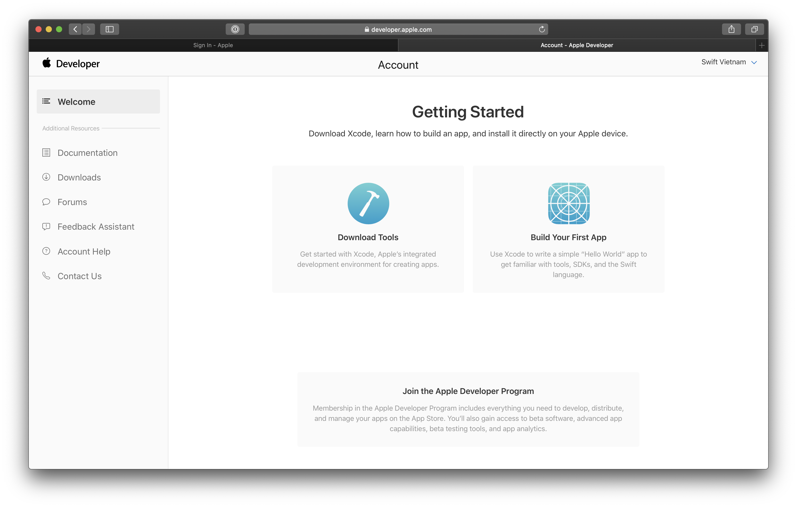
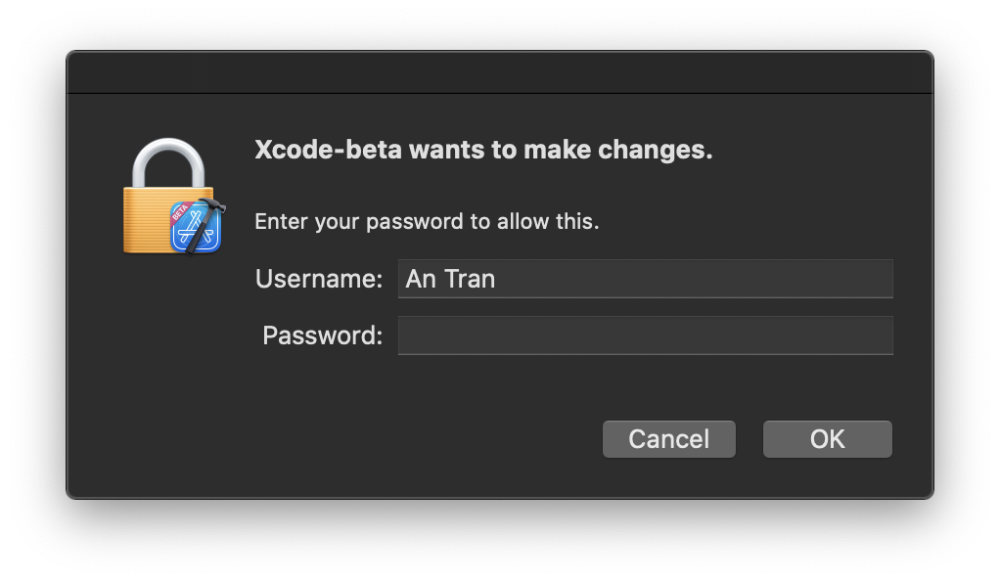

summary: Swift Việt Nam - Setting up Xcode.
id: swiftvietnam_01-setting-up-xcode
categories: swiftui
tags: swiftvietnamapp
status: Published 
authors: An Tran
Feedback Link: https://swiftvietnam.com

# Swift Việt Nam - Bài 1: Setting up Xcode
<!-- ------------------------ -->
## Overview 
Duration: 1

### Bạn sẽ học gì?
- Register for a free developer account.
- Download Xcode from apple developer website.
- Setting up Xcode.
- Create a SwiftUI app from Xcode's templates.

<!-- ------------------------ -->
## Register for a free developer account
Duration: 2

### Go to [Apple Developer website](http://developer.apple.com/)

### Register

### Confirm your email

### Confirm telephone number

### Accept Apple Developer Agreement

<!-- ------------------------ -->
## Download Xcode 12 (beta)
Duration: 3

### Go to [Apple Developer Portal](http://developer.apple.com/)

### Download Xcode

<!-- ------------------------ -->
## Login into Xcode
Duration: 3

### Install additonal tools

### Login into Xcode using the Apple developer account.

