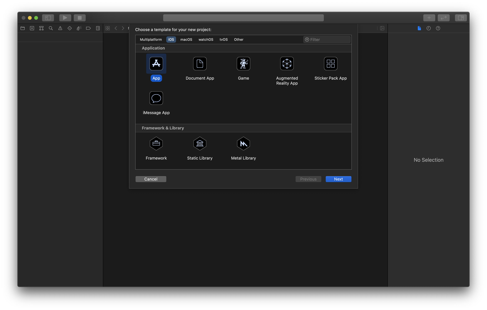
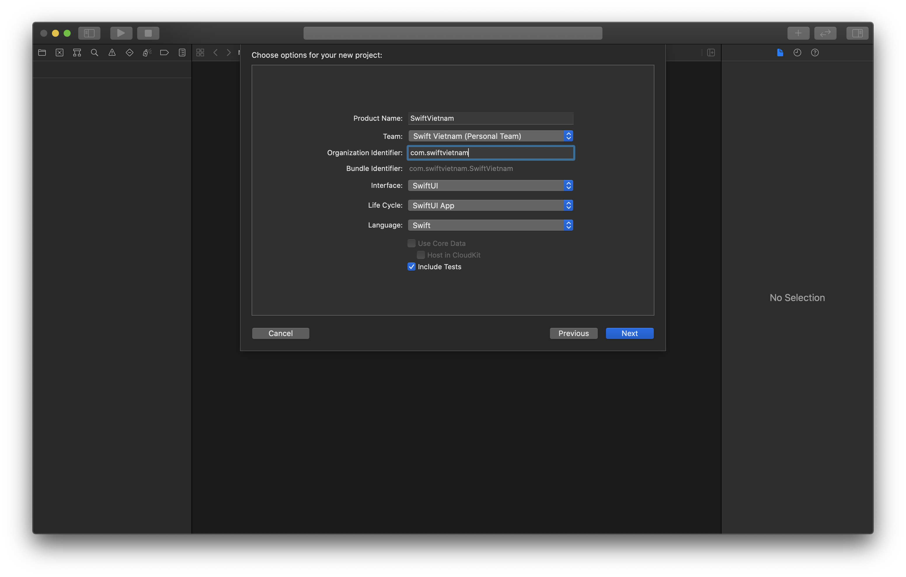
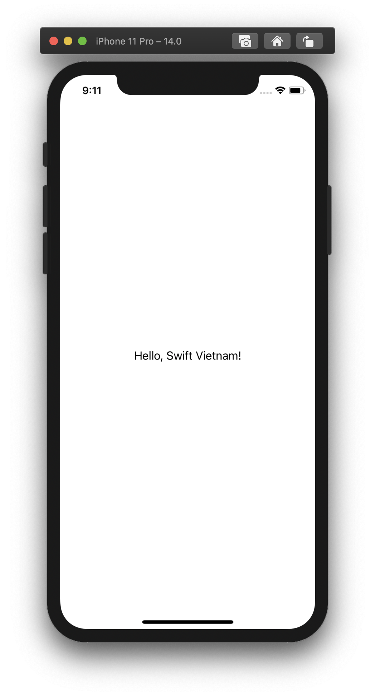

summary: Swift Việt Nam - Hello World SwiftUI.
id: swiftvietnam_02-swiftui-hello-world
categories: swiftvietnam
tags: swiftvietnam
status: Published 
authors: An Tran
Feedback Link: https://swiftvietnam.com

# Swift Việt Nam - Bài 2: Xin chào SwiftUI
<!-- ------------------------ -->
## Overview 
Duration: 1

### Bạn sẽ học gì?
- Create a SwiftUI project from Xcode's template.
- Making a first change in the code.

<!-- ------------------------ -->
## Create a SwiftUI project
Duration: 3

### Create a SwiftUI project



### SwiftUI preview panel


<!-- ------------------------ -->
## Running on a simulator
Duration: 3

### Change "Hello, World" to "Hello, Swift Vietnam"

```swift
struct ContentView: View {
    var body: some View {
        Text("Hello, Swift Vietnam!").padding()
    }
}
```


### Run app on Simulator

