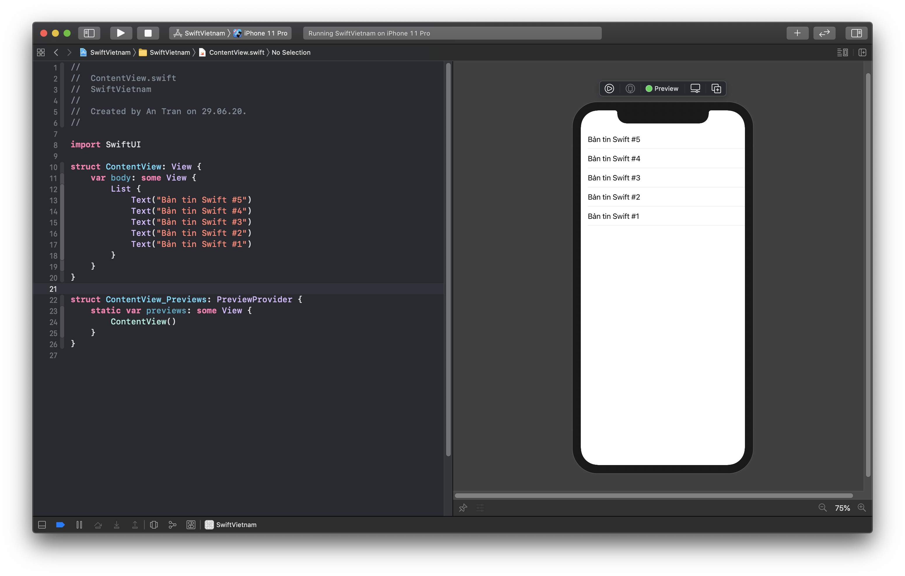
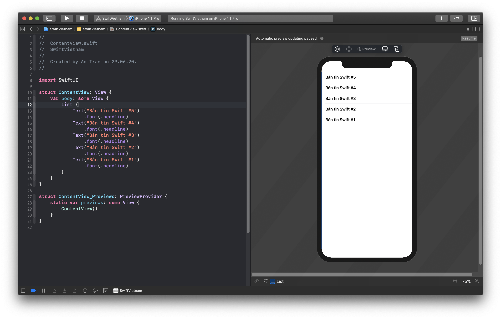
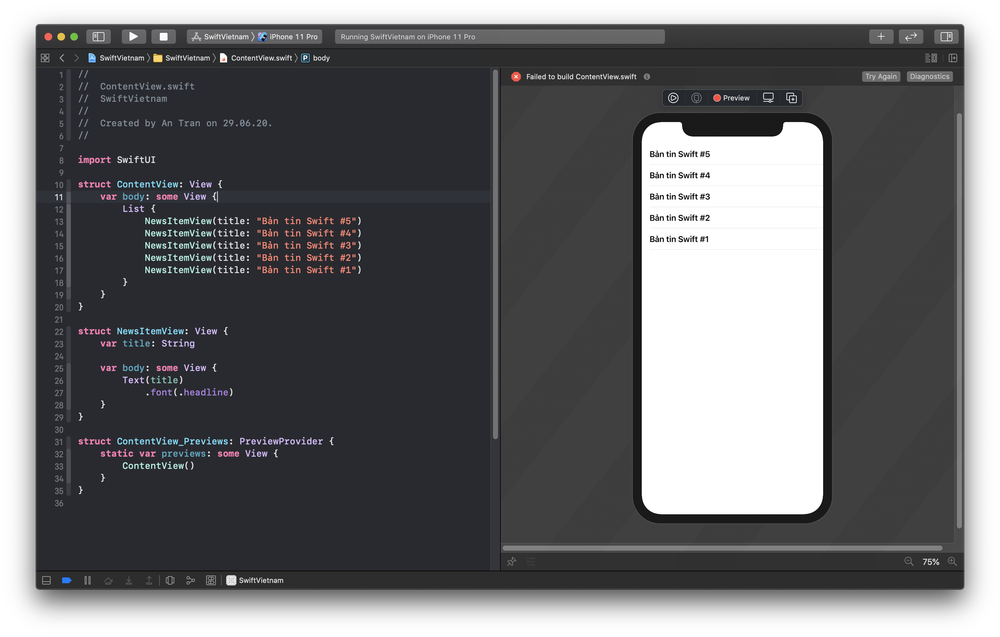

summary: Swift Việt Nam - Basic styling.
id: swiftvietnam_03-basic-styling
categories: swiftvietnam
tags: swiftvietnam
status: Published 
authors: An Tran
Feedback Link: https://swiftvietnam.com

# Swift Việt Nam - Bài 3: Basic Styling
<!-- ------------------------ -->
## Overview 
Duration: 1

### Bạn sẽ học gì?
- Create a `List`.
- Create a `CardView`.
- Separate an UI element to a separated `View`
- Make it dynamic.

<!-- ------------------------ -->
## Create a `List`
Duration: 3

```swift
struct ContentView: View {
    var body: some View {
        List {
            Text("Bản tin Swift #5")
            Text("Bản tin Swift #4")
            Text("Bản tin Swift #3")
            Text("Bản tin Swift #2")
            Text("Bản tin Swift #1")
        }
    }
}
```



<!-- ------------------------ -->
## Change headline font
Duration: 3

```swift
struct ContentView: View {
    var body: some View {
        List {
            Text("Bản tin Swift #5")
                .font(.headline)
            Text("Bản tin Swift #4")
                .font(.headline)
            Text("Bản tin Swift #3")
                .font(.headline)
            Text("Bản tin Swift #2")
                .font(.headline)
            Text("Bản tin Swift #1")
                .font(.headline)
        }
    }
}
```



<!-- ------------------------ -->
## Separate Item into `ItemView`
Duration: 3

```swift
struct ContentView: View {
    var body: some View {
        List {
            NewsItemView(title: "Bản tin Swift #5")
            NewsItemView(title: "Bản tin Swift #4")
            NewsItemView(title: "Bản tin Swift #3")
            NewsItemView(title: "Bản tin Swift #2")
            NewsItemView(title: "Bản tin Swift #1")
        }
    }
}

struct NewsItemView: View {
    var title: String

    var body: some View {
        Text(title)
            .font(.headline)
    }
}
```



<!-- ------------------------ -->
## Make it dynamic
Duration: 3

```swift
struct ContentView: View {
    let tasks = [
        "Bản tin Swift #5",
        "Bản tin Swift #4",
        "Bản tin Swift #3",
        "Bản tin Swift #2",
        "Bản tin Swift #1"
    ]
    var body: some View {
        List {
            ForEach(tasks, id: \.self) { task in
                NewsItemView(title: task)
            }
        }
    }
}
```

