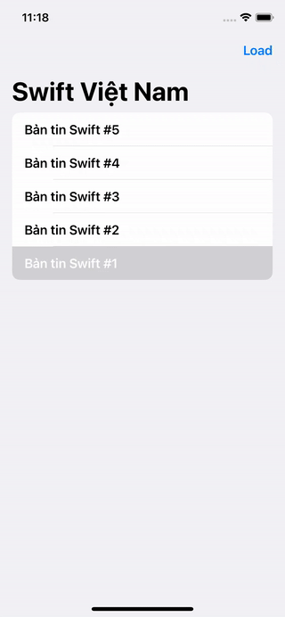

summary: Swift Việt Nam - Using UIKit.
id: swiftvietnam_05-using-uikit
categories: SwiftUI
tags: swiftvietnamapp
status: Published
authors: An Tran
Feedback Link: https://swiftvietnam.com

# Swift Việt Nam - Bài 05: Using UIKit
<!-- ------------------------ -->
## Overview
Duration: 1

### Bạn sẽ học gì?
- Tích hợp UIKit vào SwiftUI
- Mở một `View` khác chồng lên `View` hiện tại

<!-- ------------------------ -->
## `SafariView` 
Duration: 5

### Tích hợp SFSafariViewController vào SafariView 

```swift
import Foundation
import SwiftUI
import SafariServices

struct SafariView: UIViewControllerRepresentable {

    let url: URL

    func makeUIViewController(context: UIViewControllerRepresentableContext<SafariView>) -> SFSafariViewController {
        return SFSafariViewController(url: url)
    }

    func updateUIViewController(_ uiViewController: SFSafariViewController, context: UIViewControllerRepresentableContext<SafariView>) {
    }
}
```

<!-- ------------------------ -->
## Lưu liên kết
Duration: 5

### Thêm biến `link` để lưu liên kết

```swift
@State var link: URL? = nil
```

### Thêm `Button` vào `NewsItemView` 

```swift
// ContentView.swift
List {
    ForEach(newsItems, id: \.self) { item in
        Button(action: {
            self.link = item.link
        }) {
            NewsItemView(item: item)
        }
    }
}
```

### Toàn bộ mã nguồn `ContentView`

```swift
import SwiftUI

struct NewsItem: Hashable {
    let title: String
    let link: URL
}

extension URL: Identifiable {
    public var id: String {
        self.absoluteString
    }
}

struct ContentView: View {
    @State var newsItems: [NewsItem] = []
    @State var link: URL? = nil

    var body: some View {
        NavigationView {
            List {
                ForEach(newsItems, id: \.self) { item in
                    Button(action: {
                        self.link = item.link
                    }) {
                        NewsItemView(item: item)
                    }
                }
            }
            .sheet(item: $link, content: { link in
                SafariView(url: link)
            })
            .navigationTitle("Swift Việt Nam")
            .navigationBarItems(
                trailing: Button(action: {
                    self.newsItems = [
                        NewsItem(
                            title: "Bản tin Swift #5",
                            link: URL(string: "https://swiftvietnam.com/posts/2020-06-17_ban_tin_swift_vietnam_so_5/")!
                        ),
                        NewsItem(
                            title: "Bản tin Swift #4",
                            link: URL(string: "https://swiftvietnam.com/posts/2020-06-10_ban_tin_swift_vietnam_so_4/")!
                        ),
                        NewsItem(
                            title: "Bản tin Swift #3",
                            link: URL(string: "https://swiftvietnam.com/posts/2020-06-03_ban_tin_swift_vietnam_so_3/")!
                        ),
                        NewsItem(
                            title: "Bản tin Swift #2",
                            link: URL(string: "https://swiftvietnam.com/posts/2020-05-27_ban_tin_swift_vietnam_so_2/")!

                        ),
                        NewsItem(
                            title: "Bản tin Swift #1",
                            link: URL(string: "https://swiftvietnam.com/posts/2020-05-20_ban_tin_swift_vietnam_so_1/")!

                        )
                    ]
                }) {
                    Text("Load")
                }
            )
        }
    }
}

struct NewsItemView: View {
    var item: NewsItem

    var body: some View {
        Text(item.title)
            .font(.headline)
    }
}

#if DEBUG
struct ContentView_Previews: PreviewProvider {
    static var previews: some View {
        ContentView()
    }
}
#endif
```

### Kết quả

