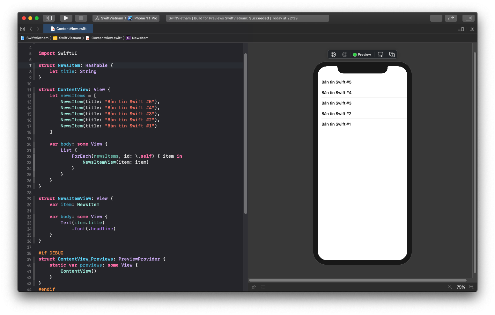
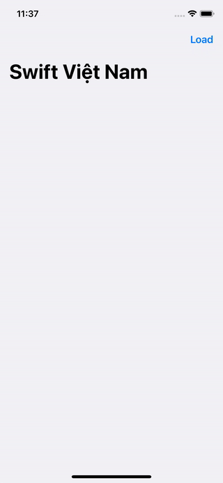

summary: Swift Việt Nam - Using UIKit.
id: swiftvietnam_05-using-uikit
categories: swiftui
tags: swiftvietnamapp
status: Published
authors: An Tran
Feedback Link: https://swiftvietnam.com

# Swift Việt Nam - Bài 5: Using UIKit
<!-- ------------------------ -->
## Overview
Duration: 1

### Bạn sẽ học gì?
- Integrate UIKit components into SwiftUI apps

<!-- ------------------------ -->
## Creating `NewsItem` 
Duration: 3

```swift
// In ContentView.swift

struct NewsItem: Hashable {
    let title: String
}

struct ContentView: View {
    let newsItems = [
        NewsItem(title: "Bản tin Swift #5"),
        NewsItem(title: "Bản tin Swift #4"),
        NewsItem(title: "Bản tin Swift #3"),
        NewsItem(title: "Bản tin Swift #2"),
        NewsItem(title: "Bản tin Swift #1")
    ]

    var body: some View {
        List {
            ForEach(newsItems, id: \.self) { item in
                NewsItemView(item: item)
            }
        }
    }
}

struct NewsItemView: View {
    var item: NewsItem

    var body: some View {
        Text(item.title)
            .font(.headline)
    }
}
```
### Kết quả



<!-- ------------------------ -->
## Make list of news items dynamic 
Duration: 3

### Using `@State` to define a dynamic variable

```swift
struct ContentView: View {
    @State var newsItems: [NewsItem] = []

    var body: some View {
        NavigationView {
            List {
                ForEach(newsItems, id: \.self) { item in
                    NewsItemView(item: item)
                }
            }
            .navigationTitle("Swift Việt Nam")
            .navigationBarItems(
                trailing: Button(action: {
                    self.newsItems = [
                        NewsItem(title: "Bản tin Swift #5"),
                        NewsItem(title: "Bản tin Swift #4"),
                        NewsItem(title: "Bản tin Swift #3"),
                        NewsItem(title: "Bản tin Swift #2"),
                        NewsItem(title: "Bản tin Swift #1")
                    ]
                }) {
                    Text("Load")
                }
            )
        }
    }
}

```


### Kết quả



<!-- ------------------------ -->
## Extend `NewsItem` to have `link` property
Duration: 3
