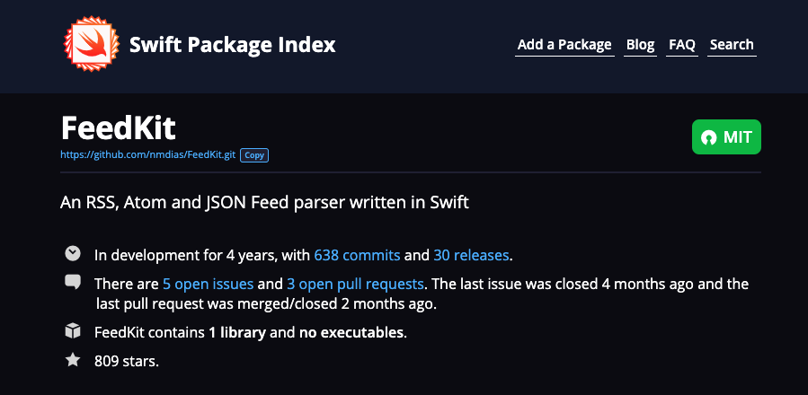

summary: Swift Việt Nam - Remote Datasource.
id: swiftvietnam_06-remote-datasource
categories: SwiftUI
tags: swiftvietnamapp
status: Published
authors: An Tran
Feedback Link: https://swiftvietnam.com

# Swift Việt Nam - Bài 06: Lấy dữ liệu từ RSS Feed
<!-- ------------------------ -->
## Overview
Duration: 1

### Bạn sẽ học gì?
- Quản lý thư viện bên thứ 3.
- Tìm kiếm Swift Package.
- Tích hợp Swift Package vào Xcode.
- Sử dụng FeedKit để tải RSS Feed từ Internet.

<!-- ------------------------ -->
## Quản lý 3rd-party dependencies
Duration: 5

Các lựa chọn để quản lý dependencies
- [Cocoapods](https://cocoapods.org/)
- [Carthage](https://github.com/Carthage/Carthage)
- [Swift Package Manager](https://swift.org/package-manager/)

<!-- ------------------------ -->
## Tìm kiếm Swift Package
Duration: 5

### Sử dụng [Github](https://github.com) hoặc [Swift Package Index](https://swiftpackageindex.com/) để tìm kiếm thư viện bên thứ 3.




<!-- ------------------------ -->
## Tích hợp Swift Package vào Xcode
Duration: 5


<!-- ------------------------ -->
## Sử dụng FeedKit để tải RSS Feed từ Internet
Duration: 10

### Heading 

```swift
struct ContentView: View {
    static let feedURL = URL(string: "https://swiftvietnam.com/feed.rss")!

    @State var newsItems: [NewsItem] = []
    @State var link: URL? = nil

    var body: some View {
        NavigationView {
            List {
                ForEach(newsItems, id: \.self) { item in
                    Button(action: {
                        self.link = item.link
                    }) {
                        NewsItemView(item: item)
                    }
                }
            }
            .sheet(item: $link, content: { link in
                SafariView(url: link)
            })
            .navigationTitle("Swift Việt Nam")
            .navigationBarItems(
                trailing: Button(action: {
                    self.loadFeed()
                }) {
                    Text("Load")
                }
            )
        }
    }

    private func loadFeed() {
        let parser = FeedParser(URL: Self.feedURL)

        // Parse asynchronously, not to block the UI.
        parser.parseAsync(queue: DispatchQueue.global(qos: .userInitiated)) { result in
            switch result {
            case .success(let feed):
                guard let rssFeed = feed.rssFeed else {
                    print("Feed ist empty")
                    return
                }
                self.parseFeed(rssFeed)
            case .failure(let error):
                print("Error: \(error)")
            }
        }
    }

    private func parseFeed(_ feed: RSSFeed) {
        let newsItems = feed.items?.compactMap { rssFeedItem -> NewsItem? in
            guard let title = rssFeedItem.title,
                  let link = rssFeedItem.link,
                  let url = URL(string: link) else {
                return nil
            }

            return NewsItem(
                title: title,
                link: url
            )
        }

        // Go back the the main thread to update the UI.
        DispatchQueue.main.async {
            self.newsItems = newsItems ?? []
        }
    }
}
```

### Kết quả

