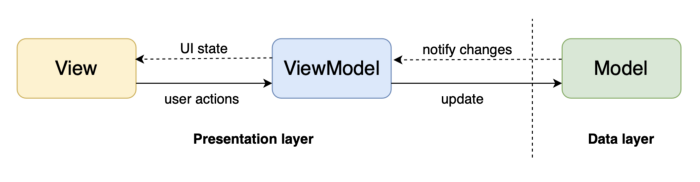
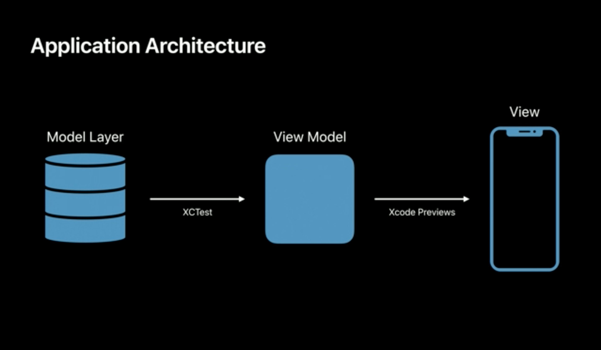

summary: Swift Việt Nam - Kiến trúc MVVM.
id: swiftvietnam_07-mvvm-architecture
categories: swiftui
tags: swiftvietnamapp
status: Published
authors: An Tran
Feedback Link: https://swiftvietnam.com

# Swift Việt Nam - Bài 07: Kiến trúc MVVM
<!-- ------------------------ -->
## Overview
Duration: 1

### Bạn sẽ học gì?
- Xây dựng kiến trúc MVVM.
- Tích hợp Swift Package Manager

<!-- ------------------------ -->
## Kiến trúc MVVM là gì? 
Duration: 5

- MVVM
 

- Apple cũng khuyến khích kiến trúc MVVM cho SwiftUI.
 

<!-- ------------------------ -->
## Tạo `ViewModel`
Duration: 5

```swift
struct ContentView: View {

    class ViewModel: ObservableObject {
        static let feedURL = URL(string: "https://swiftvietnam.com/feed.rss")!

        @Published private(set) var newsItems: [NewsItem] = []
        @Published private(set) var link: URL? = nil

        func select(_ link: URL?) {
            self.link = link
        }

        func loadFeed() {
            let parser = FeedParser(URL: Self.feedURL)

            // Parse asynchronously, not to block the UI.
            parser.parseAsync(queue: DispatchQueue.global(qos: .userInitiated)) { result in
                switch result {
                case .success(let feed):
                    guard let rssFeed = feed.rssFeed else {
                        print("Feed ist empty")
                        return
                    }
                    self.parseFeed(rssFeed)
                case .failure(let error):
                    print("Error: \(error)")
                }
            }
        }

        private func parseFeed(_ feed: RSSFeed) {
            let newsItems = feed.items?.compactMap { rssFeedItem -> NewsItem? in
                guard let title = rssFeedItem.title,
                      let link = rssFeedItem.link,
                      let url = URL(string: link) else {
                    return nil
                }

                return NewsItem(
                    title: title,
                    link: url
                )
            }

            // Go back the the main thread to update the UI.
            DispatchQueue.main.async {
                self.newsItems = newsItems ?? []
            }
        }
    }

    @ObservedObject private var viewModel = ViewModel()

    init() {
        viewModel.loadFeed()
    }

    var body: some View {
        NavigationView {
            List {
                ForEach(viewModel.newsItems, id: \.self) { item in
                    Button(action: {
                        viewModel.select(item.link)
                    }) {
                        NewsItemView(item: item)
                    }
                }
            }
            .sheet(item: .init(
                get: {
                    viewModel.link
                },
                set: {
                    viewModel.select($0)
                }
            ), content: { link in
                SafariView(url: link)
            })
            .navigationTitle("Swift Việt Nam")
            .navigationBarItems(
                trailing: Button(action: {
                    viewModel.loadFeed()
                }) {
                    Text("Load")
                }
            )
        }
    }
}
```