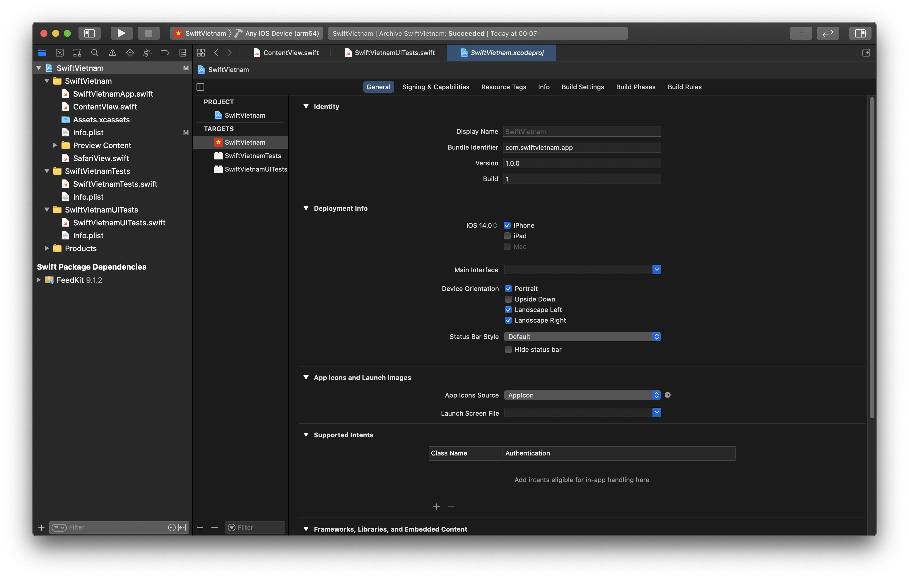
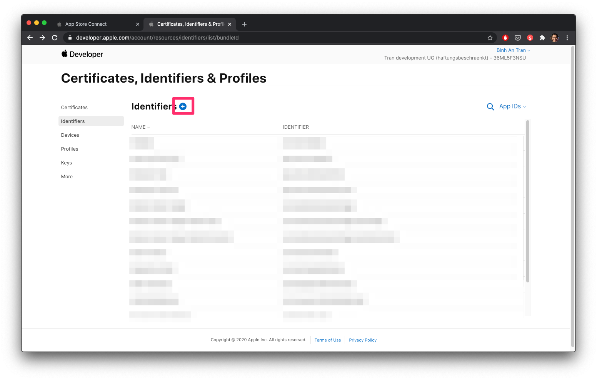
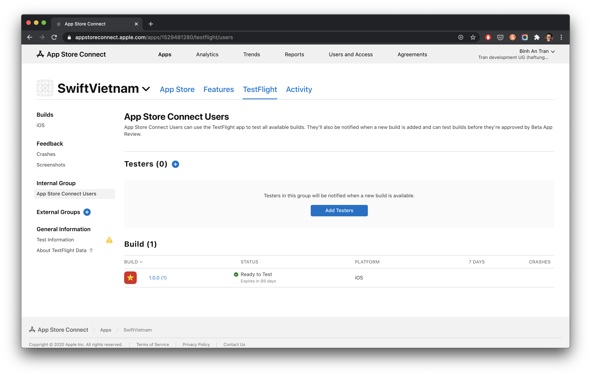
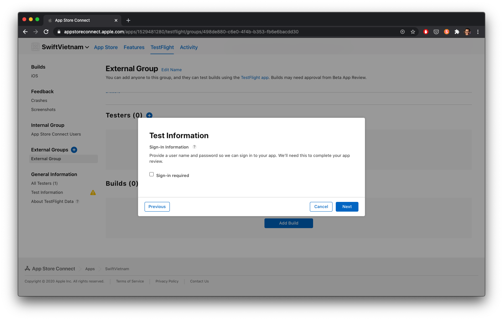
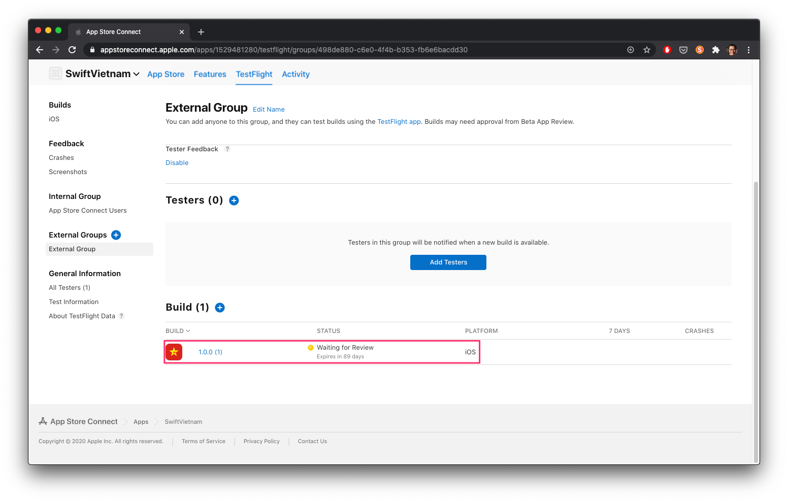

summary: Swift Việt Nam - Kiểm thử bằng Testflight.
id: swiftvietnam_09-testing-with-testflight
categories: SwiftUI
tags: swiftvietnamapp
status: Published
authors: An Tran
Feedback Link: https://swiftvietnam.com

# Swift Việt Nam - Bài 09: Kiểm thử bằng Testflight
<!-- ------------------------ -->
## Overview
Duration: 1

### Bạn sẽ học gì?
- Các bước chuẩn bị
- Archive một phiên bản gửi App Store bằng Xcode
- Chuẩn bị thông tin cho ứng dụng trên Developer Portal và App Store Connect
- Tải app lên App Store Connect bằng Xcode

<!-- ------------------------ -->
## Tạo logo 
Duration: 10

- Tạo một ảnh logo bằng một ứng dụng đồ hoạ bất kỳ có kích thước 1024x1024 pixel

- Truy cập trang [appicon.co](https://appicon.co/) để tự động tạo các icon với các kích thước cần thiết cho Xcode.
 

- Tải icons về máy, unzip
 

- Copy icon set vừa tạo vào Xcode

### Kết quả

<!-- ------------------------ -->
## Archive một phiên bản gửi App Store bằng Xcode
Duration: 5

- Chỉnh sửa version number

- Chọn `Any iOS Device`

- Chạy `Archive`

- Chạy `Archive`

- Kết quả

<!-- ------------------------ -->
## Chuẩn bị thông tin cho ứng dụng trên Developer Portal
Duration: 10

- Truy cập Apple Developer Portal

- Đăng ký một identifier mới

<!-- ------------------------ -->
## Chuẩn bị thông tin cho ứng dụng trên App Store Connect 
Duration: 10

- Thêm ứng dụng mới

<!-- ------------------------ -->
## Tải ứng dụng lên App Store Connect
Duration: 5

- Tải ứng dụng lên App Store Connect bằng Xcode

- Kiểm tra App Store Connect

<!-- ------------------------ -->
## Gửi Testflight build đến Internal Testers 
Duration: 5

- Khai báo thông tin về sử dụng mã hoá

- Gửi Testflight build đến Internal Testers

<!-- ------------------------ -->
## Gửi Testflight build đến External Testers
Duration: 5

